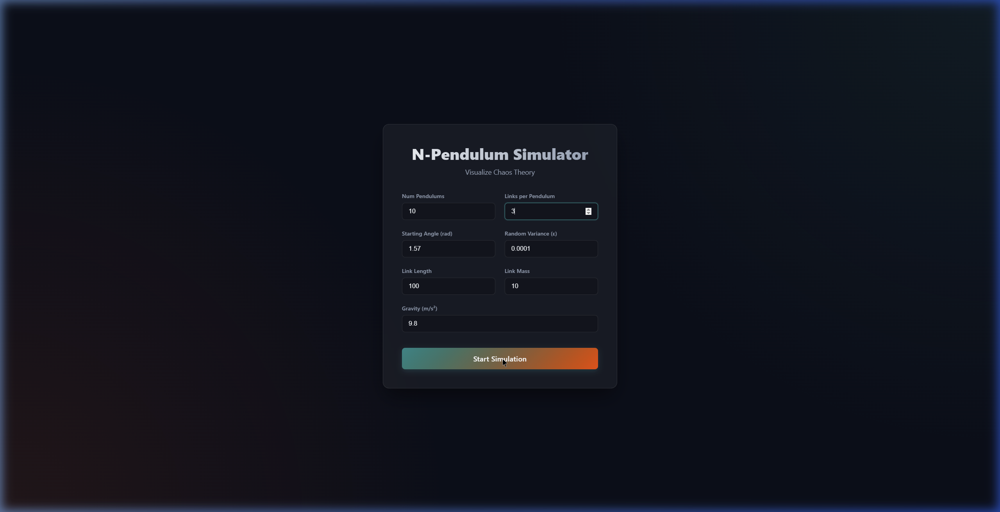
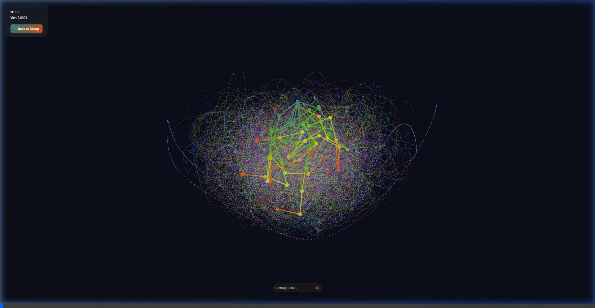

# N-Pendulum-Simulator
Vibe coding with Antigravity

A chaotic N-link pendulum simulator built in Vanilla Javascript with high-performance Canvas rendering. Features a customizable generalized matrix solver to simulate everything from simple double pendulums to incredibly complex multi-link chaotic systems.

## Setup Configuration
Configure the number of links, masses, lengths, and starting angles with a sleek glassmorphic UI before diving into the simulation.

## Simulations in Action

### Double Pendulum (2 Links)

### Hexa Pendulum (6 Links)

